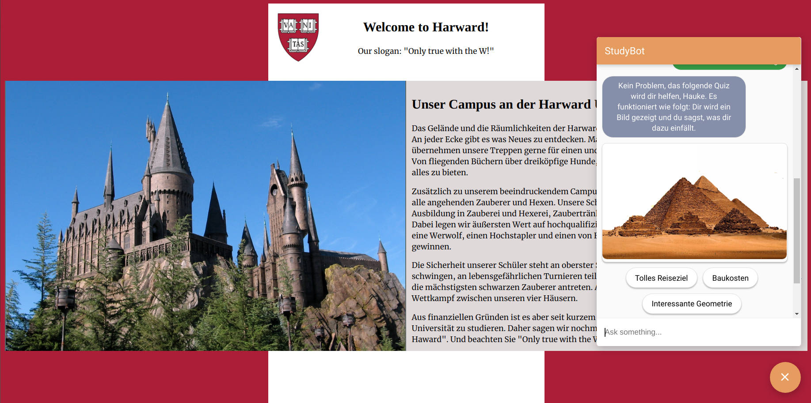

# study_advisor_bot
This project was created for the msg Code &amp; Create event during a weekend in July 2020. 

It is a flask app to deploy a website of the "Harward" university via Heroku. Key of the application is the voice assistant, created with DialogFlow. 

You can find the website of our imaginary university at:
https://harward-study-advisor-bot.herokuapp.com/

(Due to the scope of the event, website and chatbot are in German language.)

The code in this project is mostly related to the website, that is the context of the chatbot.

The actually chat logic was constructed in a Dialogflow project:
https://dialogflow.cloud.google.com/#/agent/studybot-ircnjp/intents

